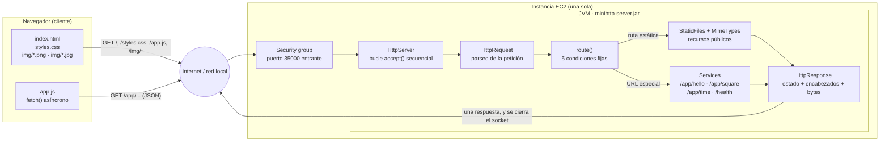
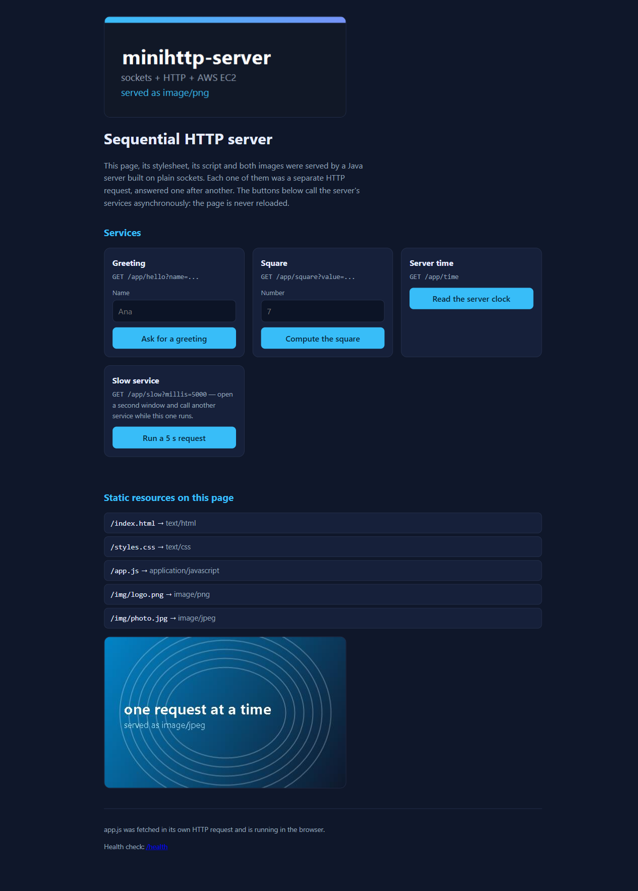
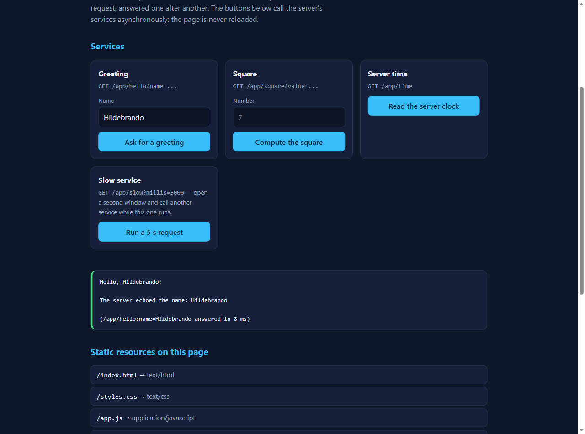
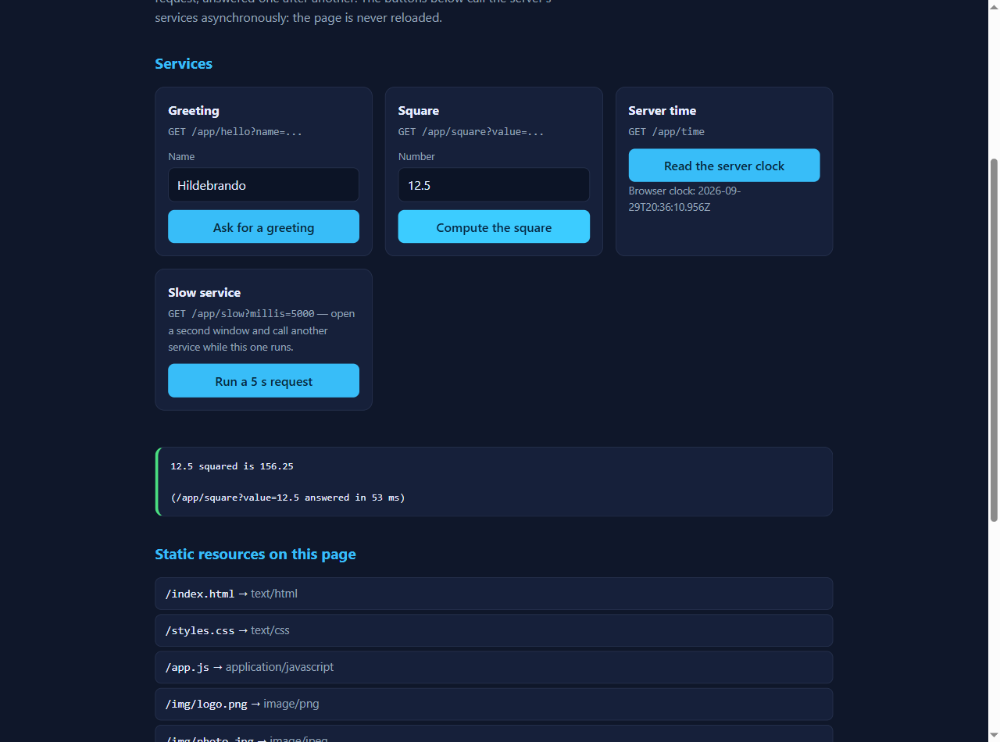
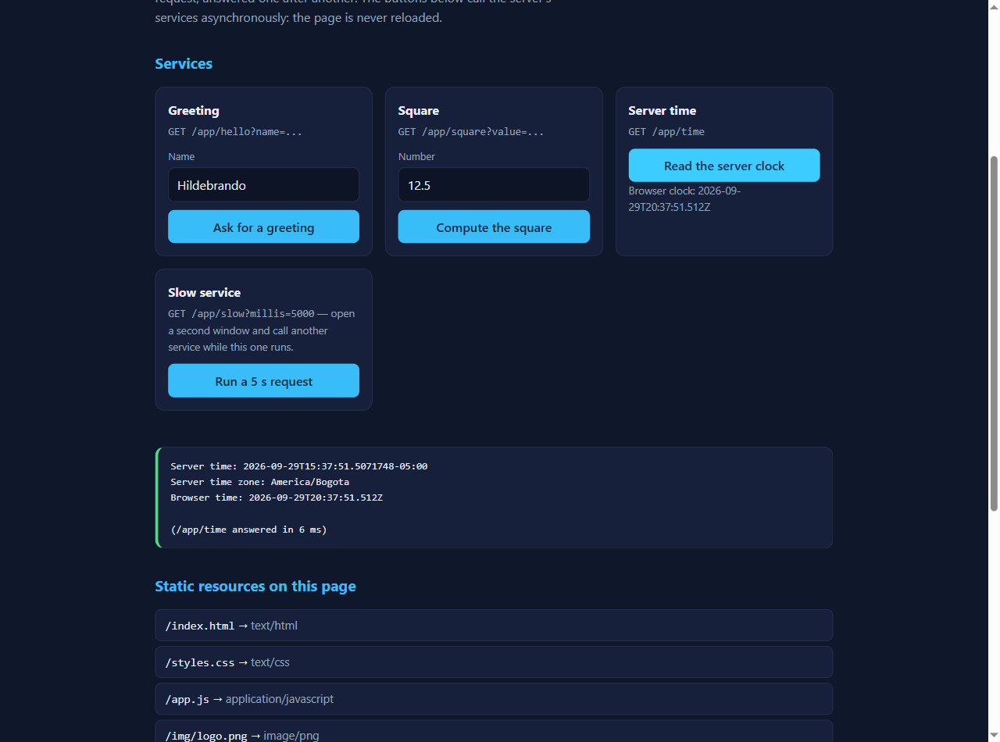
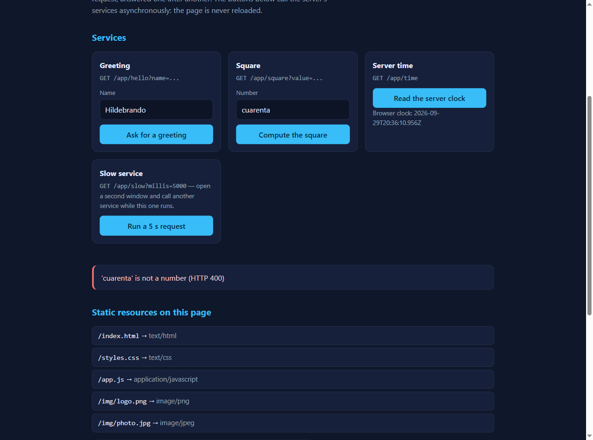
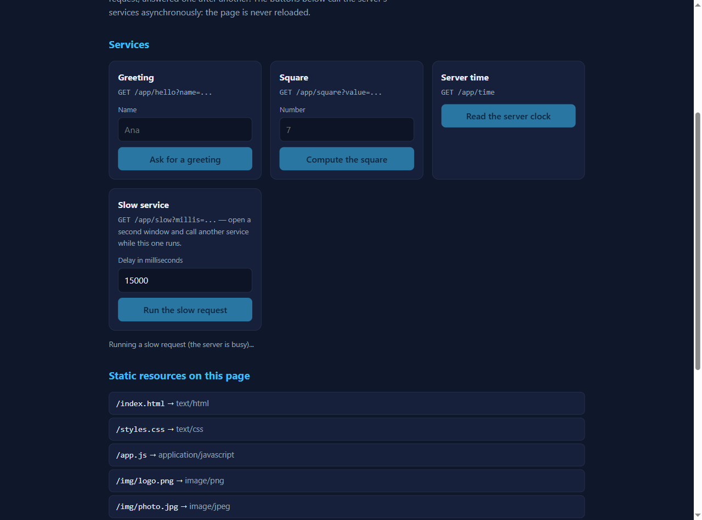
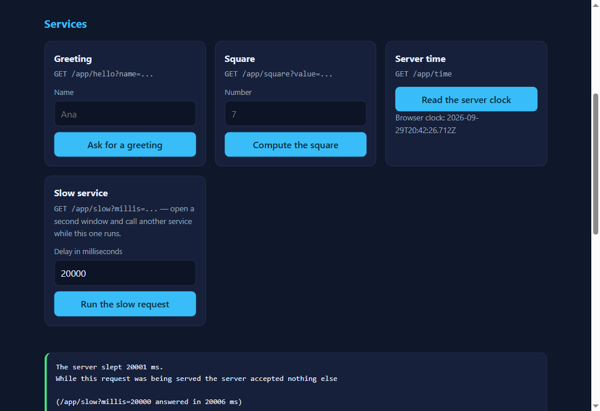
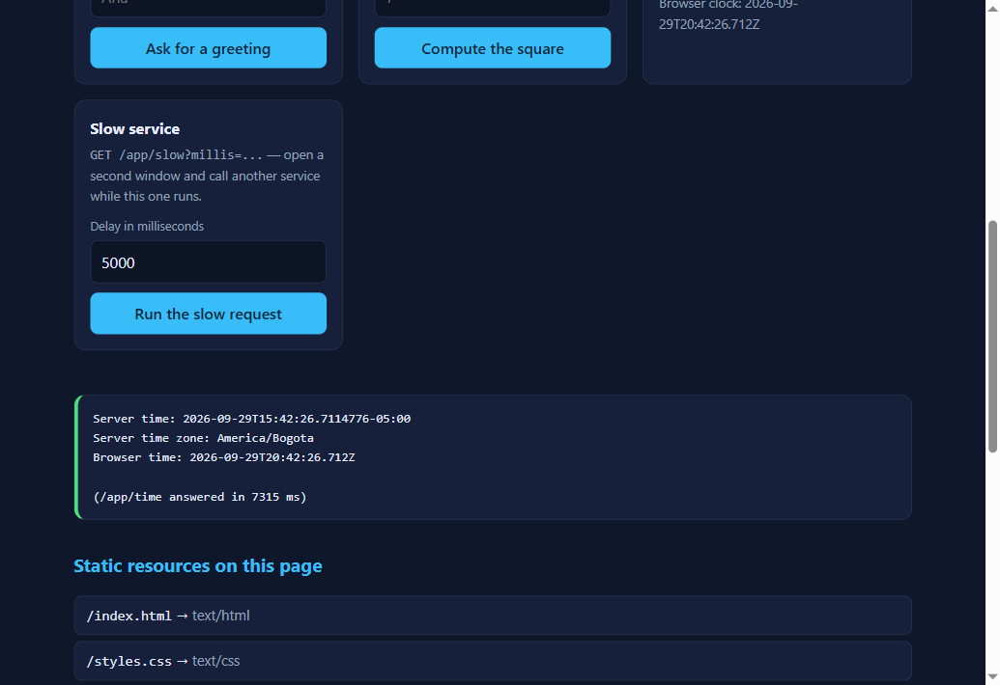

# minihttp-server — De un servidor HTTP mínimo a una aplicación web

Servidor web secuencial escrito en Java sobre sockets TCP, sin frameworks ni
librerías externas. Entrega archivos estáticos (HTML, CSS, JavaScript, PNG y
JPEG) y expone cuatro servicios con URLs fijas que responden JSON. La página que
sirve es también su cliente: usa `fetch()` para llamar a esos servicios sin
recargarse.

El laboratorio parte del servidor mínimo de la guía de redes (una conexión, una
respuesta, y termina) y lo extiende hasta una mini aplicación web que puede
empaquetarse en un solo `.jar` y ejecutarse en una instancia EC2.

**El objetivo no es que el servidor sea rápido.** El objetivo es entender dónde
está el límite: el servidor atiende **una conexión a la vez**. Ese límite se deja
visible a propósito, se mide y se documenta, porque es el punto de partida para
hablar después de concurrencia y de distribución.

| | |
|---|---|
| Lenguaje | Java 17+ |
| Build | Maven |
| Dependencias de ejecución | ninguna |
| Dependencias de prueba | JUnit 5 |
| Puerto por defecto | 35000 |
| Concurrencia | ninguna (a propósito) |

---

## Metáfora del sistema

> **Una ventanilla única de atención al público.**

La metáfora del sistema (*system metaphor*, de Extreme Programming) es la imagen
compartida que permite que cualquier persona entienda cómo colaboran las partes
sin leer todo el código:

| En la ventanilla | En el sistema |
|---|---|
| **La fila de gente** que llega al edificio | Las conexiones TCP que llegan al `ServerSocket` |
| **La ventanilla**, con *un solo* funcionario | El bucle `accept()` de `HttpServer`: atiende a una persona, la despide, y solo entonces llama a la siguiente |
| **El formato diligenciado** que trae cada persona | La petición HTTP: método, ruta, versión y encabezados |
| **El archivador** con documentos ya impresos | `StaticFiles`: la carpeta de recursos públicos (página, estilos, script, imágenes) |
| **Cuatro trámites** que el funcionario hace a mano | `Services`: saludo, cuadrado, hora del servidor y chequeo de salud |
| **El sello que dice de qué tipo es el documento** | El encabezado `Content-Type` |
| **El vigilante que no deja entrar al archivo interno** | La normalización de rutas: `..`, rutas ocultas y separadores raros se rechazan |
| **El mensajero** que vuelve varias veces por cada documento | El navegador: pide la página, y al leerla vuelve por el CSS, el script y cada imagen |
| **El mensajero que no se queda parado esperando** | El cliente asíncrono: `fetch()` deja la página viva mientras llega la respuesta |

La metáfora explica también el límite del laboratorio: **aunque el mensajero sea
muy ágil, la ventanilla sigue siendo una sola.** Si un trámite tarda cinco
minutos, el siguiente espera cinco minutos, por más rápido que corra el
mensajero.

## Arquitectura



### Responsabilidad de cada componente

| Componente | Archivo | Responsabilidad |
|---|---|---|
| `HttpServer` | [HttpServer.java](src/main/java/edu/escuelaing/arep/httpserver/HttpServer.java) | Abre el socket de escucha, acepta conexiones **una por una**, lee la petición, decide quién la atiende, escribe la respuesta y cierra el socket del cliente. Convierte cualquier falla en una respuesta de error controlada. |
| `HttpRequest` | [HttpRequest.java](src/main/java/edu/escuelaing/arep/httpserver/HttpRequest.java) | Parte la línea de petición (`GET /app/square?value=7 HTTP/1.1`), separa ruta y *query string*, decodifica los parámetros y guarda los encabezados. |
| `HttpResponse` | [HttpResponse.java](src/main/java/edu/escuelaing/arep/httpserver/HttpResponse.java) | Arma la respuesta: línea de estado, encabezados, línea en blanco y cuerpo. El cuerpo **siempre** es un arreglo de bytes, por eso `Content-Length` es el tamaño real. |
| `StaticFiles` | [StaticFiles.java](src/main/java/edu/escuelaing/arep/httpserver/StaticFiles.java) | Resuelve la ruta pedida dentro del área pública, rechaza rutas inseguras y lee el archivo como bytes (desde disco o desde el `.jar`). |
| `MimeTypes` | [MimeTypes.java](src/main/java/edu/escuelaing/arep/httpserver/MimeTypes.java) | Tabla extensión → `Content-Type`. |
| `Services` | [Services.java](src/main/java/edu/escuelaing/arep/httpserver/Services.java) | Los cuatro servicios fijos más un servicio lento usado para evidenciar el límite secuencial. No guarda estado entre peticiones. |
| `Json` | [Json.java](src/main/java/edu/escuelaing/arep/httpserver/Json.java) | Escritor de JSON mínimo, con escape explícito de todo valor que venga del usuario. |
| `Urls` | [Urls.java](src/main/java/edu/escuelaing/arep/httpserver/Urls.java) | Decodificación de `%XX` y parseo de la *query string*. |
| `HttpException` | [HttpException.java](src/main/java/edu/escuelaing/arep/httpserver/HttpException.java) | Error HTTP con código (400, 403, 404, 405, 500) que cualquier capa puede lanzar. |
| Cliente | [index.html](src/main/resources/public/index.html), [app.js](src/main/resources/public/app.js), [styles.css](src/main/resources/public/styles.css) | Interfaz del usuario y llamadas asíncronas a los servicios. |

---

## Decisiones de diseño

**Por qué el servidor sigue siendo secuencial.** No se agregó ningún hilo,
*executor* ni cola. El bucle acepta una conexión, la atiende completa, la cierra
y solo entonces vuelve a `accept()`. Esa es la restricción del laboratorio: antes
de distribuir trabajo hay que poder ver y medir el límite de una sola instancia.
El servicio `/app/slow` existe justamente para hacer ese límite visible
(sección [Evidencias](#evidencias-y-resultados)).
El único hilo del proyecto está en la prueba de integración, donde el bucle corre
aparte para que la prueba pueda actuar como cliente.

**Por qué las rutas están quemadas en el código.** `route()` es una lista de
cinco `if` explícitos. No hay tabla de rutas, ni anotaciones, ni reflexión, ni
inyección de dependencias. Un framework generalizaría exactamente esas cinco
condiciones, y al hacerlo escondería el mecanismo que el laboratorio quiere
mostrar: *la ruta de la URL es lo que selecciona el comportamiento*.

**Cómo se escoge el `Content-Type`.** Se deriva de la extensión del archivo con
una tabla fija (`MimeTypes`). Si la extensión no está en la tabla, el recurso no
se sirve (404). El navegador no adivina qué recibió: interpreta lo que ese
encabezado le diga, y por eso el mismo flujo de bytes puede terminar siendo una
página, un script o una imagen.

**Por qué todo se lee como bytes.** Texto e imágenes viajan por el mismo camino.
Si una imagen se leyera como texto, la conversión de caracteres la dañaría, y
`Content-Length` quedaría mal calculado (un carácter no es un byte en UTF-8).
Leer bytes evita los dos problemas de una sola vez.

**Cómo se rechazan las rutas inseguras.** La ruta se decodifica primero y después
se parte en segmentos. Un segmento `..` se **rechaza** (403), no se resuelve;
también se rechazan los segmentos ocultos (`.env`), el separador `\`, el byte NUL
y los prefijos de unidad (`C:`). Cuando los recursos se leen de disco se verifica
además que la ruta final, ya resueltos los enlaces simbólicos, siga estando
dentro del área pública. Son dos defensas independientes sobre el mismo ataque.

**Por qué el cliente es asíncrono.** Si la página se recargara en cada consulta,
el navegador tendría que volver a pedir la página, el CSS, el script y las
imágenes: cinco peticiones de más por cada clic, y en un servidor secuencial eso
se nota. Con `fetch()` solo viaja la petición del servicio y solo cambia el área
de resultado.

**Solo se acepta GET.** Cualquier otro método responde `405` con el encabezado
`Allow: GET`. El laboratorio no necesita cuerpo de petición.

**El puerto es configuración, no código.** Se toma del primer argumento de la
línea de comandos, o de la variable de entorno `PORT`, o queda en 35000.

---

## Estructura del proyecto

```
arep-minihttp-server/
├── pom.xml                        Descriptor Maven (Java 17, JUnit 5, jar ejecutable)
├── README.md
├── .gitignore
├── deploy/
│   ├── minihttp-server.service    Unidad systemd para que corra como servicio en EC2
│   └── install-on-ec2.sh          Instalación desatendida en la instancia
├── docs/
│   ├── REFLECTION.md              Respuestas a las ocho preguntas de discusión
│   ├── EVIDENCE.md                Matriz de pruebas con el resultado observado
│   ├── local-evidence.txt         Transcripción de las pruebas con curl
│   ├── network-requests.txt       Lista de peticiones vista en el navegador
│   └── img/                       Capturas de pantalla
├── src/
│   ├── main/
│   │   ├── java/edu/escuelaing/arep/httpserver/
│   │   │   ├── HttpServer.java         Bucle secuencial y enrutamiento
│   │   │   ├── HttpRequest.java        Parseo de la petición
│   │   │   ├── HttpResponse.java       Construcción de la respuesta
│   │   │   ├── StaticFiles.java        Recursos públicos y rutas seguras
│   │   │   ├── MimeTypes.java          Extensión → Content-Type
│   │   │   ├── Services.java           Servicios con URL fija
│   │   │   ├── Json.java               Escritor de JSON con escape
│   │   │   ├── Urls.java               Decodificación de URL y query string
│   │   │   └── HttpException.java      Errores HTTP controlados
│   │   └── resources/public/           Área pública servida por el servidor
│   │       ├── index.html
│   │       ├── styles.css
│   │       ├── app.js
│   │       └── img/{logo.png, photo.jpg, favicon.png}
│   └── test/java/edu/escuelaing/arep/httpserver/
│       ├── HttpServerIntegrationTest.java   Pruebas sobre sockets reales
│       ├── HttpServerRoutingTest.java
│       ├── StaticFilesTest.java
│       ├── ServicesTest.java
│       ├── HttpRequestTest.java
│       ├── MimeTypesTest.java
│       ├── JsonTest.java
│       └── UrlsTest.java
```

Los recursos públicos viven en `src/main/resources/public`, así que Maven los
empaqueta dentro del `.jar`: para desplegar basta con copiar un archivo.

---

## Prerrequisitos

* **JDK 17 o superior** (el proyecto compila con `maven.compiler.release=17`).
* **Maven 3.8 o superior**.
* Un navegador moderno (la interfaz usa `fetch`, `URL` y `async/await`).
* Opcional: `curl` para probar los servicios desde la terminal.

Verificación rápida:

```bash
java -version
mvn -version
```

## Instalación y construcción

```bash
git clone <URL-del-repositorio>
cd arep-minihttp-server

mvn clean package          # descarga dependencias, compila, corre las pruebas y empaqueta
```

El resultado es `target/minihttp-server.jar`, con los recursos públicos adentro y
la clase principal declarada en el manifiesto.

Para empaquetar sin correr las pruebas: `mvn clean package -DskipTests`.

## Cómo ejecutarlo localmente

```bash
# opción 1: el artefacto empaquetado (lo mismo que se despliega)
java -jar target/minihttp-server.jar

# opción 2: en otro puerto, por argumento
java -jar target/minihttp-server.jar 8080

# opción 3: en otro puerto, por variable de entorno
PORT=8080 java -jar target/minihttp-server.jar

# opción 4: sin empaquetar, desde el código compilado
mvn compile
java -cp target/classes edu.escuelaing.arep.httpserver.HttpServer
```

Al arrancar imprime el puerto y de dónde está leyendo los recursos:

```
minihttp-server listening on http://0.0.0.0:35000
Sequential mode: one connection at a time.
Public resources: classpath:/public/
```

Después se abre <http://localhost:35000/> en el navegador. Para detenerlo,
`Ctrl+C` en la terminal donde quedó corriendo.

Si se quiere editar el HTML o el JavaScript sin volver a empaquetar, se puede
apuntar el área pública a la carpeta de fuentes:

```bash
PUBLIC_DIR=src/main/resources/public java -jar target/minihttp-server.jar
```

## Cómo se usa la aplicación

La página de inicio es la interfaz. Ninguna acción recarga la página: cambia
únicamente el área de resultado (borde verde) o el área de error (borde rojo).

| Acción en la página | Petición que envía | Respuesta |
|---|---|---|
| Escribir un nombre y *Ask for a greeting* | `GET /app/hello?name=Ana` | `{"service":"greeting","name":"Ana","greeting":"Hello, Ana!"}` |
| Escribir un número y *Compute the square* | `GET /app/square?value=7` | `{"service":"square","value":7,"square":49}` |
| *Read the server clock* | `GET /app/time` | `{"service":"time","iso":"...","zone":"America/Bogota","epochMillis":...}` |
| *Run the slow request* | `GET /app/slow?millis=5000` | Responde cuando termina de dormir; sirve para ver el límite secuencial |
| Enlace *Health check* | `GET /health` | `{"status":"UP","uptimeMillis":...}` |

Entradas y errores esperados:

| Caso | Resultado |
|---|---|
| Nombre vacío | El cliente avisa sin llamar al servidor |
| `?name=` vacío o solo espacios | `400` — *Missing required query parameter 'name'* |
| Nombre de más de 60 caracteres | `400` |
| Número inválido (`cuarenta`, `NaN`, `1e200`) | `400` — el mensaje del servidor se muestra como texto amable |
| `millis` fuera de `0..20000` | `400` |
| Archivo estático inexistente | `404` con página de error |
| Método distinto de GET | `405` con `Allow: GET` |
| Ruta con `..`, oculta o con `\` | `403`, sin revelar nada del disco |
| Servidor apagado | El cliente distingue la falla de red y muestra *"The server could not be reached"* |

Los mismos servicios se pueden probar desde la terminal:

```bash
curl -i "http://localhost:35000/app/hello?name=Ana%20Mar%C3%ADa"
curl -i "http://localhost:35000/app/square?value=7"
curl -i "http://localhost:35000/app/time"
curl -i "http://localhost:35000/health"
curl -i "http://localhost:35000/app/square?value=hola"     # 400
curl -i -X POST "http://localhost:35000/"                  # 405
curl -i --path-as-is "http://localhost:35000/../pom.xml"   # 403
```

## Cómo correr las pruebas

```bash
mvn test
```

Son **52 pruebas** en ocho clases:

| Clase | Qué verifica |
|---|---|
| `UrlsTest` | Decodificación de `%XX`, `+` en query vs. ruta, escapes rotos, query string |
| `HttpRequestTest` | Línea de petición, encabezados sin distinguir mayúsculas, peticiones malformadas |
| `MimeTypesTest` | Tipos de HTML, CSS, JS, PNG y JPEG; extensiones no soportadas |
| `StaticFilesTest` | Archivo de bienvenida, imágenes byte a byte, 404, y rechazo de `..`, `\`, ocultos y NUL |
| `JsonTest` | Escape de comillas, de caracteres de control y de marcado; formato de números |
| `ServicesTest` | Los cuatro servicios con entradas válidas e inválidas, con un reloj fijo |
| `HttpServerRoutingTest` | Qué condición de `route()` atiende cada ruta; 405 para métodos no soportados |
| `HttpServerIntegrationTest` | Sockets reales: página y recursos, `Content-Length` de las imágenes, JSON, 400/403/404/405, petición malformada que no tumba el servidor, diez peticiones seguidas y dos peticiones lentas que se encolan |

Validación manual (la de la sección 6 de la guía) en
[docs/EVIDENCE.md](docs/EVIDENCE.md), con la transcripción de `curl` en
[docs/local-evidence.txt](docs/local-evidence.txt).

---

## Despliegue en AWS EC2

> **Estado:** el procedimiento está escrito y el artefacto fue verificado
> localmente ejecutando el mismo `.jar` que se copia a la instancia. El despliegue
> remoto queda pendiente de la cuenta de AWS del curso (la cuenta usada no tiene
> créditos disponibles), por lo que las evidencias de esta entrega son locales.

La aplicación no cambia al desplegarse: cambia dónde corre y quién puede
alcanzarla. El servidor ya escucha en todas las interfaces y el puerto es
configurable, así que no hay nada que tocar en el código.

**1. Preparar el artefacto**

```bash
mvn clean package
```

**2. Lanzar la instancia**

* Una instancia Linux (Amazon Linux 2023) del tipo más pequeño aprobado, en la
  VPC/subred pública por defecto, con una etiqueta de nombre descriptiva.
* Security group con solo dos reglas de entrada:
  * SSH (22) **restringido a la IP pública propia**, nunca a `0.0.0.0/0`.
  * TCP personalizado en **35000** para el tráfico de la aplicación.

**3. Instalar y arrancar**

```bash
scp -i <llave.pem> target/minihttp-server.jar \
    deploy/minihttp-server.service deploy/install-on-ec2.sh \
    ec2-user@<dns-publico>:~

ssh -i <llave.pem> ec2-user@<dns-publico> 'bash ~/install-on-ec2.sh'
```

El script instala el runtime de Java 17, copia el `.jar` a `/opt/minihttp`,
instala la unidad de systemd, habilita el servicio y verifica
`http://localhost:35000/health` **desde adentro de la instancia** antes de que se
pruebe desde afuera.

**4. Verificar desde el navegador**

```
http://<dns-publico>:35000/
```

**5. Que siga corriendo al cerrar la sesión**

La unidad [deploy/minihttp-server.service](deploy/minihttp-server.service) deja
el proceso como servicio administrado: arranca con la instancia, se reinicia si
falla, escribe el log en `/var/log/minihttp/server.log` y se detiene limpiamente.

```bash
sudo systemctl status  minihttp-server
sudo systemctl restart minihttp-server
sudo systemctl stop    minihttp-server
sudo journalctl -u minihttp-server -f
tail -f /var/log/minihttp/server.log
```

**6. Limpieza obligatoria**

Al terminar la demostración: detener la aplicación, **terminar la instancia** y
confirmar el estado `terminated`, liberar la IP elástica si se creó una, borrar
el security group del laboratorio y revisar el costo en la consola de facturación.
Una instancia olvidada sigue generando cobro aunque nadie la use.

> En el repositorio no hay llaves, credenciales, tokens ni identificadores de
> cuenta. El `.gitignore` excluye `*.pem`, `*.key`, `.env` y `.aws/`.

---

## Evidencias y resultados

Todas las capturas están en [docs/img/](docs/img). La matriz completa de pruebas
con el resultado observado está en [docs/EVIDENCE.md](docs/EVIDENCE.md).

| Evidencia | Captura |
|---|---|
| Página de inicio con sus dos imágenes y el script ejecutándose |  |
| Servicio de saludo, sin recargar la página |  |
| Servicio de cuadrado con un decimal |  |
| Hora del servidor frente a la hora del navegador |  |
| Entrada inválida: el `400` del servidor se vuelve un mensaje amable |  |
| Archivo inexistente: `404` |  |
| Intento de salirse del área pública: `403` |  |
| Estado de carga: botones deshabilitados y la página sigue viva |  |
| Servicio lento terminado |  |
| **El límite secuencial**: la ventana B pidió `/app/time` mientras la ventana A tenía ocupado al servidor, y su respuesta tardó **7315 ms** en lugar de 4 ms |  |
| Servicio de salud |  |

Peticiones vistas en el navegador al cargar **una sola** página
([docs/network-requests.txt](docs/network-requests.txt)):

```
GET /                 200  text/html
GET /styles.css       200  text/css
GET /img/logo.png     200  image/png
GET /img/photo.jpg    200  image/jpeg
GET /app.js           200  application/javascript
GET /img/favicon.png  200  image/png
```

Medición del límite secuencial con dos clientes simultáneos
([docs/local-evidence.txt](docs/local-evidence.txt)):

```
A  GET /app/slow?millis=5000 -> HTTP 200  arranca en +0.0s  total 5.003s
B  GET /app/time             -> HTTP 200  arranca en +0.3s  total 4.673s
```

`B` normalmente responde en milisegundos. Aquí esperó casi lo mismo que faltaba
para que `A` terminara: el bucle no pudo aceptar a `B` hasta despachar a `A`.

Las respuestas a las ocho preguntas de discusión están en
[docs/REFLECTION.md](docs/REFLECTION.md).

---

## Limitaciones conocidas

Esto **no** es un servidor HTTP de producción. Las limitaciones son deliberadas:

* **Secuencial:** una conexión a la vez. Dos usuarios con peticiones lentas se
  encolan; el segundo espera al primero.
* **Solo GET.** No hay POST, PUT ni DELETE, ni lectura del cuerpo de la petición.
* **Servicios quemados.** Cuatro URLs fijas (más la lenta). No hay enrutador
  general, ni parámetros de ruta, ni negociación de contenido.
* **HTTP incompleto.** No hay conexiones persistentes (siempre `Connection:
  close`), ni `Transfer-Encoding: chunked`, ni compresión, ni caché condicional
  (`ETag` / `If-Modified-Since`), ni rangos de bytes, ni HTTPS.
* **Sin estado ni persistencia.** Nada se guarda entre peticiones: no hay sesión,
  ni base de datos, ni autenticación.
* **Sin límites de tamaño ni protección contra abuso**, más allá de un tiempo de
  espera de 15 s por cliente y del tope del servicio lento.
* **Una sola instancia**, es decir un solo punto de falla y un solo techo de
  capacidad.

El siguiente paso arquitectónico es la concurrencia (que el servidor atienda más
de una conexión a la vez), y solo después tiene sentido hablar de balanceo de
carga: replicar un servidor que solo atiende de a uno multiplica el problema en
lugar de resolverlo.

## Autor y agradecimientos

**Hildebrando P. Q.** — Escuela Colombiana de Ingeniería Julio Garavito,
Arquitecturas Empresariales (AREP).

Material y referencias usadas:

* Guía del laboratorio *From a Minimal HTTP Server to a Web Application on AWS* y
  la sección 4.4 de la guía de redes del curso, que aporta el servidor mínimo del
  que parte este proyecto.
* [RFC 9110 — HTTP Semantics](https://www.rfc-editor.org/rfc/rfc9110.html) y
  [RFC 9112 — HTTP/1.1](https://www.rfc-editor.org/rfc/rfc9112.html) para la
  forma de la petición y de la respuesta.
* Documentación de Java SE 17: `java.net.ServerSocket`, `java.net.Socket`,
  `java.nio.file.Files`.
* [MDN Web Docs](https://developer.mozilla.org/) para `fetch`, `URL`,
  `URLSearchParams` y el manejo de errores en el cliente.
* [Launch an Amazon EC2 instance](https://docs.aws.amazon.com/AWSEC2/latest/UserGuide/EC2_GetStarted.html),
  [Connect to your Linux instance](https://docs.aws.amazon.com/AWSEC2/latest/UserGuide/connect-to-linux-instance.html)
  y [Security group rules](https://docs.aws.amazon.com/AWSEC2/latest/UserGuide/security-group-rules-reference.html)
  para el despliegue y las reglas de entrada.
* JUnit 5 para las pruebas.
